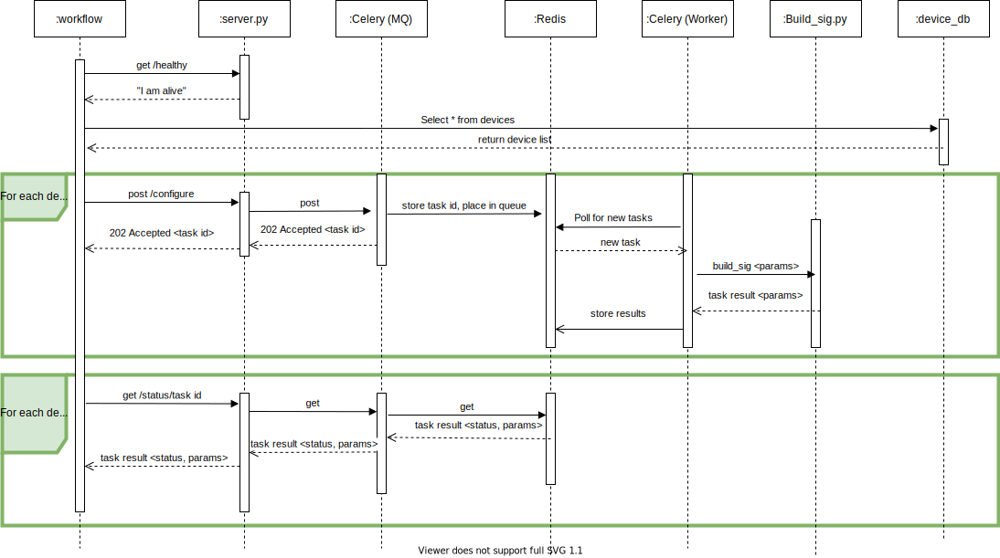

# SIG_XE - Mass configure Umbrella Secure Internet Gateway on routers.
This project configures Umbrella Secure Internet Gateway (SIG) on remote
network devices. Customers can quickly provision large, distributed networks
and perform automated key rollovers to integrate with SIG. The solution is
particularly useful for disaster response/humanitarian operations, but can be
used for any use case in which it is well-suited.

> Contact information:\
> Steven McNutt (Cisco Systems / stmcnutt@cisco.com)\
> Nick Russo (Cisco Systems / nickrus@cisco.com)

## Devnet Create Presentation
[Devnet Create 2021 Powerpoint Deck](create_preso/create_preso.pptx)

## Workflow Overview

> **Note:** This is a proof of concept workflow. The sidecar is not hardened for production use!

---------------------------------------------------------------------------

  * [Required Targets](#Required-Targets)
  * [Required Account Keys](#Required-Account-Keys)
  * [Required Global Variables](#Required-Global-Variables)
  * [Required Local Variables](#Required-Local-Variables)
  * [External Dependencies](#External-dependencies)
  * [Setup Instructions](#Setup-instructions)
  * [Notes](#Notes)
----------------------------------------------------------------------------

## Required Targets
- `sig_me` sidecar: References the IP of the `docker-compose` sidecar app.
- `sig_me_db`: References the mySQL database string within SXO

## Required Account Keys
- `sig_me_db_creds`: Define these to include the mySQL username and password.

## Required Global Variables
- `umbrella_org_id`: The numeric Umbrella organization ID to which you have read/write access.
- `umbrella_api_key`: The Umbrella Management API key; used as HTTP basic auth username.
- `umbrella_api_secret`: The Umbrella Management API secret; used as HTTP basic auth password.

## Required Local Variables
- `device_username`: The shell login username on the managed network device (router, firewall, etc.)
- `device_password`: The shell login password on the managed network device (router, firewall, etc.) 

## External Dependencies
- SQL Database for `sig_me_db` connection.
- Instance of sidecar `docker-compose` app running on-premises for `sig_me` Sidecar.
- Optional remote connector if you can't create a NAT/firewall rule for the sidecar/SXO communications.

## Setup Instructions
* Pour yourself a fresh cup of coffee.
* Put some good music on. 
* Collect the following information of interest:
  * Hostnames
  * Keys
  * Credentials
  * IP addresses
  * TCP/UDP ports (firewall rules, etc.)
  
### Create a mySQL Database Instance
  * In my case, I used and AWS RDS mySQL instance free tier.
    * You'll need to add the public IP that SXO makes its calls from to the AWS network security group (NSG).
      * An easy way to get this is make an HTTP target using a high TCP port number that points at a firewall.
      * Create a workflow that runs an HTTP request.
      * Check the event log on the firewall to get the IP.
      * Add this IP to the AWS NSG for your mySQL database instance.
  
### Create the mySQL Database
  * Open the `example_db_setup_script` in the `sql/` directory.
  * Change the values to match the devices you want to configure.
  * Log in to the database with the mySQL client and paste your text in.

### Set Up the Sidecar
  * Spin up an Ubuntu (or your favorite distro) instance.
  * Write down the IP for the `sig_me` Sidecar hostname/IP.
    * If using connector just use this IP and port 5000.
    * If NAT/firewall, make a rule that allows TCP/5000 from SXO.
  * Install Docker and `docker-compose` on the instance.
  * Clone this repository to the instance.
  * Open an SSH session and then:
    * Go to the sidecar folder
    * Type `docker-compose build` (one time only) 
    * Type `docker-compose up` (whenever you want to bring up the sidecar)
  * NOTE: `docker-compose` down will bring the sidecar down

### Modify http and JDBC Targets
  * Open `sig_me.json` in a text editor.
  * Search for targets to go to the targets section
    * Change the `sig_me` Sidecar "host": value to the sidecar hostname/IP.
    * Change the `sig_me_db` "server": value to the mySQL hostname/IP.

### Deploy SXO Remote Connector (Optional)
  * This is the preferred option as compared to a firewall/NAT rule.
    However, at the time of this writing, the connector is still beta and not reliable
  
### Import the Workflow

1. In the left pane menu, select **Workflows**. Click on **IMPORT** to import the workflow.

2. Click on **Browse** and copy paste the content of your edited `sig_me.json` file
   inside of the text window. Select **IMPORT AS A NEW WORKFLOW (CLONE)** and click on **IMPORT**.

3. Next steps, like updating targets/account keys, setting a trigger, and running the workflow.

4. If the mySQL target is unreachable, you'll get an import error.
   Ensure SXO can reach the database and the import should be successful.

## Notes

This is a proof of concept workflow. The sidecar is not hardend for production use!
