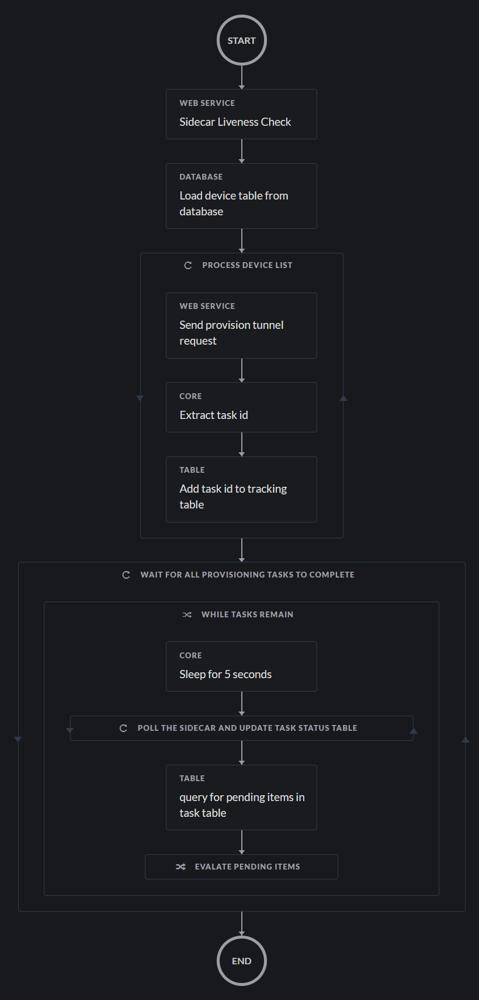

# SecureY SXO Hackathon Submission

## Features
* Configures Umbrella Secure Internet Gateway on a list of routers

## workflow overview: 

> **Note:** This is a proof of concept workflow. The sidecar is not hardend for production use!

---------------------------------------------------------------------------

  * [Required targets](#Required-Targets)
  * [Required account keys](#Required-Account-Keys)
  * [Required global variables](#Required-Global-Variables)
  * [Required local variables](#Required-Local-Variables)
  * [External Dependencies](#External-dependencies)
  * [Setup instructions](#Setup-instructions)
  * [Notes](#Notes)
  * [Planned Improvements](#Planned-Improvements)
  * [Authors](#Author(s))
----------------------------------------------------------------------------

## Required Targets
- sig_me Sidecar
- sig_me_db

## Required Account Keys
- sig_me_db_creds (mysql username/password)

## Required Global Variables
- umbrella_org_id
- umbrella_api_key
- umbrella_api_secret

## Required Local Variables
- device_username
- device_password

## External dependencies
- SQL Database for sig_me_db
- instance of sidecar docker compose app running on-prem for sig_me Sidecar
- optional remote connector if you can't create a nat/firewall rule for the sidecar<-->SXO

## Setup instructions
* Pour yourself a fresh cup of coffee.
* Put some good music on. 
* Gather up your hostnames, keys, and credentials
* make sure you record the IP addresses and ports from the external dependency setup (which we will tackle first)
  
### Create a mysql database instance
  * In my case I used and AWS RDS mySQL instance free tier.
    * you'll need to add the public ip SXO makes it's calls from to the AWS network security group
      * an easy way to get this is make an http target using a high port that points at a firewall
      * create a workflow that runs an http request
      * check the event log on the firewall to get the ip :)
      * add this IP to the AWS NSG for your db instance
  
### Create the database and table in the mySQL instance
  * open the example_db_setup_script in the sql folder
  * change the values to match the devices you want to configure
  * log in to the db with the mysql client and paste your text in so create and populate your db

### Set up the sidecar
  * spin up an ubuntu (or your favorite distro) vm
  * write down the ip for the sig_me Sidecar hostname/ip
    * if using connector just use this ip and port 5000 
    * if NAT/firewall, make a rule that allows TCP/5000 from sxo
  * install docker and docker-compose on it
  * clone this repository to the vm
  * from an ssh session:
    * go to the sidecar folder
    * type docker-compose build (one time only) 
    * type docker-compose up (whenever you want to bring up the sidecar)
  * NOTE* docker-compose down will bring the sidecar down

### Edit sig_me.json to modify our http and JDBC targets
  * open sig_me.json in a text editor
  * search for targets to go to the targets section
    * change the sig_me Sidecar "host": value to the hostname or ip of your sidecar
    * change the sig_me_db "server": value to the hostname or ip of your mysql instance 

### (optional) deploy SXO remote connector and configure sig_me http target to use
  * This is the preferred option over over a firewall/nat rule.
    * however at the time of this writing connector is still very beta and not reliable
  
### Import the workflow

1. In the left pane menu, select **Workflows**. Click on **IMPORT** to import the workflow.

2. Click on **Browse** and copy paste the content of your edited sig_me.json file inside of the text window.  Select **IMPORT AS A NEW WORKFLOW (CLONE)** and click on **IMPORT**.

3. Next steps, like updating targets / account keys and setting a trigger / running the workflow.

4. If the mySql target is unreachable you'll get an import error. make sure SXO can reach the database and the import should be successful

## Notes

**Note:** This is a proof of concept workflow. The sidecar is not hardend for production use!

## Planned Improvements
- [] https/let's encrypt on sidecar
- [] api key authentication on sidecar
- [] more detail in the status table
- [] proper fvrf detection in build_sig.py
- [] make test loopback interface a configurable
- [] ASA support
- [] refactor build_sig.py into a proper OO design
- [] unit and integration tests

## Author(s)

* Nick Russo (Cisco Systems)
* Steven McNutt (Cisco Systems)
